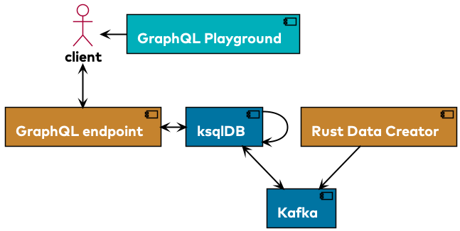

# ksqlDB GraphQL poc



Setup to serve as proof of concept in using Kafka with ksqlDB in combination with the query language GraphQL.

`js-graphql-endpoint` runs on [http://localhost:4000](http://localhost:4000)

Open interactive ksql promt: `docker exec -it ksqldb ksql http://ksqldb:8088`

The `rust-data-creator` is sending a new person every 5 seconds.

See the results*: 

```kafka-protobuf-console-consumer --topic PERSONS_BY_BIRTHYEAR --bootstrap-server localhost:9092 --from-beginning --property print.key=true --key-deserializer org.apache.kafka.common.serialization.IntegerDeserializer```

*Requires Confluent CLI or kafka-protobuf-console-consumer to be installed.